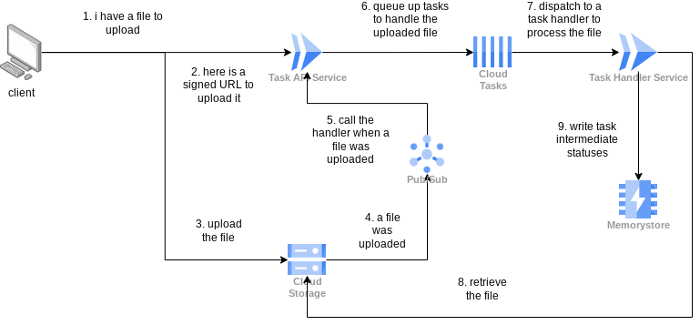

# Cloud Run based ingest process

## Architecture Diagram

## Instructions

We provide a unified deployment script `deploy.sh` that automates building and deploying both services to Cloud Run.

For detailed setup, configuration, and execution instructions, please refer to the [DEPLOYMENT.md](file:///usr/local/google/home/jkwng/code/gcp-gcs-ingest-tasks/DEPLOYMENT.md) guide.

1. **Configure Infrastructure**: Provision the bucket, queue, and service accounts using Terraform in `terraform/`.
2. **Configure deploy.sh**: Update the GCP project and resource names at the top of [deploy.sh](file:///usr/local/google/home/jkwng/code/gcp-gcs-ingest-tasks/deploy.sh).
3. **Deploy**: Run `./deploy.sh` to build and deploy both services.
4. **Test**: Use the interactive dashboard or run the code in `taskgen` to upload a random image to GCS and watch the pipeline process it.

